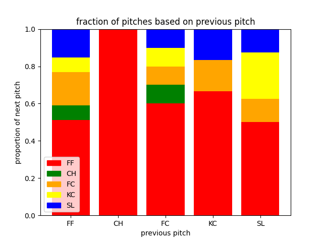
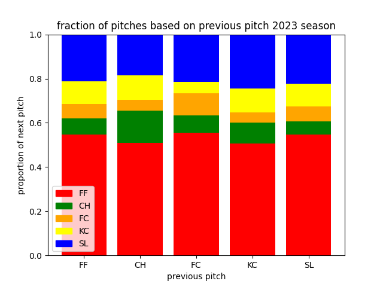

# A Close Look at Gerrit Cole's Pitch Sequencing
## *The Cy Young Award candidate was too predictable against his rival*

I probably should reconsider publishing this piece. As a Red Sox fan every fiber of my being is telling me to not let this information out; however, there is no way that the Yankees themselves are not also looking into the predictability of Gerrit Cole's pitch sequences, right?

On Saturday, August 19, 2023, Gerrit Cole threw one of his worst outings of the year at an incredibly inopportune time. Already 2 games under .500, the Yankees were hoping that their ace and front-runner for the Cy Young Award would help them right the ship against their biggest rival (yes, biggest rival, I don't care what [Nestor Cortes says](https://www.si.com/fannation/mlb/fastball/news/new-york-yankees-nestor-cortes-says-rivalry-with-boston-red-sox-is-fading)). Cole had been absolutely dominant all year. Coming in to his start against Boston he was (FILL IN STATS ON COLE'S YEAR TO THE DATE HERE).

Despite his season-long dominance, Cole struggled mightily against the Red Sox, giving up six earned runs on seven hits. He left the game after pitching just four innings, the only time this season he hasn't pitched into the fifth. After the game Cole was asked about the Red Sox approach against him and he seemed befuddled.

> ...not my best stuff today... I put a lot of well located pitches and paired a lot of good pitches together... I'm just a little bit, uhm, just confused on why the level of execution on their side is so high, you know? I mean, we funneled four or five balls into the down-and-away quadrant and it's not like we live there all day. We pitch several of those guys up-and-in, you know, quite often... for whatever reason they were extra-focused... not only did they capitalize on poor pitches but they capitalized on really, really good pitches, so, that's baseball, it's tough sometimes, you know?" ([Quote courtesy of YESNetwork](https://www.youtube.com/watch?v=q3NKZBB3rTw&ab_channel=YESNetwork)).

Some people might read this quote as Cole questioning whether he is tipping pitches without saying so out loud, others might read it as him questioning if the Sox new what was coming through nefarious means. One thing I am curious about is if he has simply become too predictable based on his pitch sequences.

As a neuroscientist in the birdsong community, I am no stranger to sequence analysis. We in the field often look at syllable transitions as a means of studying song stereoypy. I felt that applying those methods to Cole's pitch sequencing, both in his appearance against Boston and throughout this season, might indicate whether or not he has become predictable.

### A Quick Look At Cole's Sequencing

The first thing I did was look very briefly at which pitches followed which, without any context in at-bat, runners, etc. The only stipulation was the sequence didn't cross batters, so all 'next pitch' data came after the first pitch of an at-bat.

In this figure, the stacked bars are the proportion of each pitch type based on the previous pitch, indicated on the x-axis (FF = 4-seam fastball; CH = changeup; FC = cutter; KC = knuckle-curve; SL = slider).

A few things immediately jumped out to me:

1. If a CH didn't end an at-bat, Cole ALWAYS followed it with a FF (n=3, might be meaningless)
2. Cole never threw two KCs in a row, and usually followed a KC with a fastball (FF or FC)
3. A CH only ever followed a fastball
4. If the previous pitch was off-speed (CH, KC, SL), batters were more-likely-than-not to see a FF on the next pitch

I'll dive into the context of these pitches more soon, but first let's compare this to Cole's approach all season (minus his August 19 appearance against Boston).

Cole has primarily thrown FFs all season, but at a lower frequency compared to August 19. He does occasionally throw consecutive KCs and unlike against Boston he has paired every pitch in an at bat at least once. To better understand his approach I'll need more context than just one pitch following another. Let's look at pitches in specific counts.

### Count-Specific Sequencing

